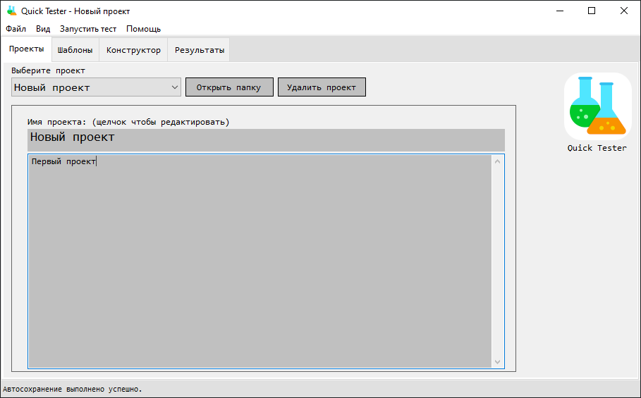

# QuickTester

Программа для само-тестирование и оценки знания. 

Это пока тестовая версия, но вы уже можете опробовать результат.

Первый взгляд: 
  *Создаем новый проект
 

  *Окно программы
 

  *Окно конструктора
 

  *Окно тестирования
 
